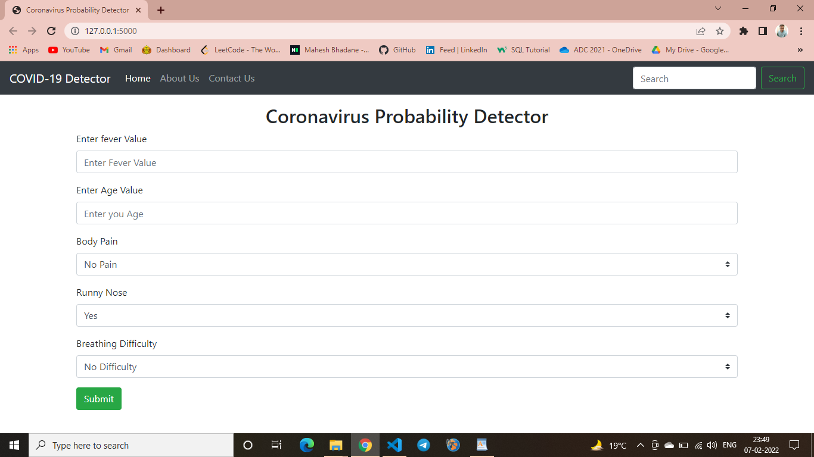
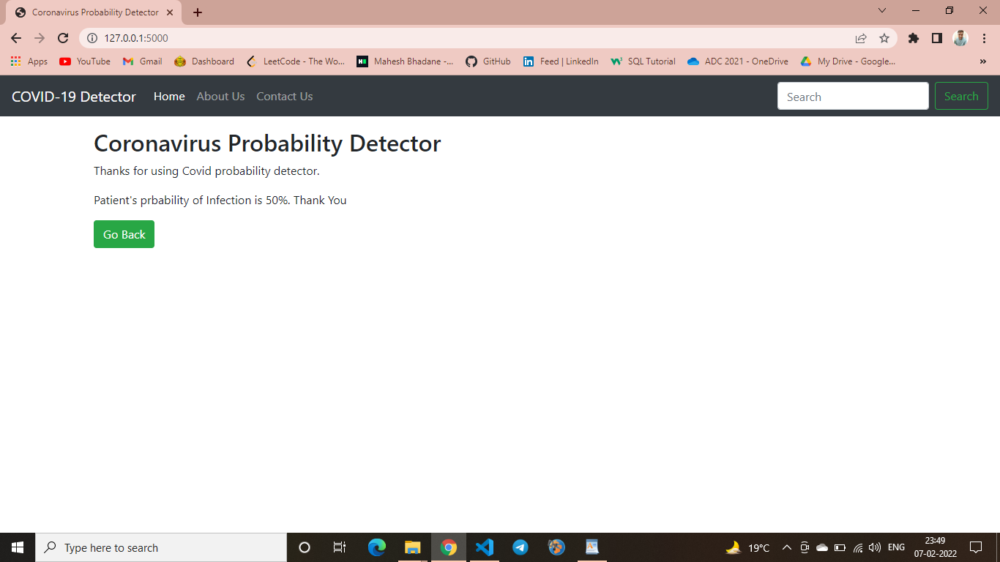

# Coronavirus-Probability-Detector
MSC Project

# Instructions to run this model on your local machine :
first run myTraining.py

run main.py , through main.py you will get a localhost link and get redirected to your browser.

 
Python code for coronavirus probability detector using data analysis and training machine learning model of logistic regression.

# Tools used:

Pycharm Community Edition 2019.3.1

# Languages used:

Python 3.8

# Steps to Install:

Open any file in IDE or Create Virtual Environment

Install libraries pickle and framework flask

Run.

# To see Full Project Report Please open Below Link :
<b> <a href="Project_Report.pdf">Coronavirus Probability Detector Project Report</a> </b>
